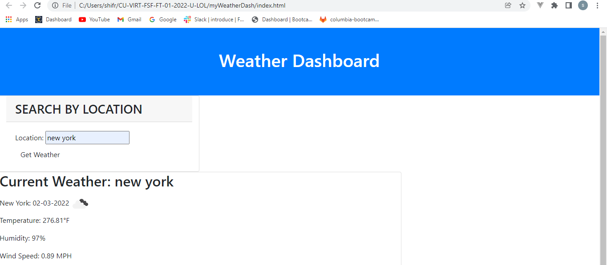

# myWeatherDash
This website uses the openweather api to pull the data/ weather of a location specified by the user. The user enters the city they would like to get the weather for and the website returns the current weather in large and the 5 day forcast in smaller cards under. Additionally, the wesite will save the cities the user searched on the side allowing the user to have easy access to a city they already searched. 

To visit this website, click on this link: https://swagshall.github.io/myWeatherDash/

Here is a screen shot of the website: 
